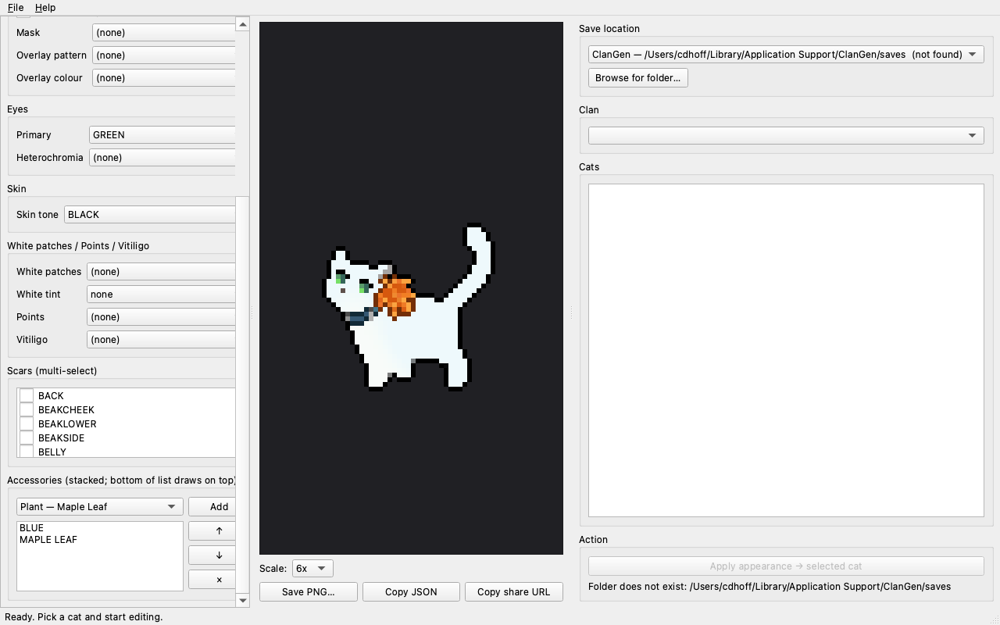

# LifeGen / ClanGen Save Editor

Cross-platform desktop app that lets you edit cats in
[ClanGen](https://github.com/ClanGenOfficial/clangen) and
[LifeGen](https://github.com/ManiiaKop/lifegen-fullgen) save files with the
full visual customization surface of
[pixel-cat-maker](https://cgen-tools.github.io/pixel-cat-maker/) built right
in.



## What it does

- **Full pixel-cat-maker functionality** — every appearance control: pelt
  pattern, colour, tint, white patches, points, vitiligo, tortoiseshell mask
  and overlay, heterochromia, skin tone, scars (multi-select), accessories,
  shading, reverse, pose.
- **Live preview** — the cat re-renders on every change, scalable 2x–12x with
  pixel-perfect nearest-neighbour scaling.
- **Pixel-cat-maker interop** — import from the tool's JSON export or its
  shareable URL; export to either format with one click.
- **Save-file editing** — auto-detects ClanGen and LifeGen save directories
  on Windows / macOS / Linux. Browse clans, pick a cat, click *Apply* to merge
  the current appearance into that cat. Identity, relationships, and every
  other field are left untouched.
- **Safe writes** — a timestamped backup of `clan_cats.json` is created before
  every save. The actual write is atomic (tmp file then rename).

## Install

Requires Python 3.9 or newer.

```bash
git clone <this repo>
cd lifegen-save-editor
python3 -m venv .venv
.venv/bin/pip install -r requirements.txt
```

## Run

```bash
.venv/bin/python -m lifegen_editor
```

## How saves are located

The editor uses the same `platformdirs` lookup the games use:

| OS      | ClanGen path                                                       |
|---------|--------------------------------------------------------------------|
| macOS   | `~/Library/Application Support/ClanGen/saves`                      |
| Linux   | `~/.local/share/ClanGen/saves`                                     |
| Windows | `%LOCALAPPDATA%\ClanGen\ClanGen\saves`                             |

Swap `ClanGen` → `LifeGen` for the LifeGen paths. If you have a portable / source-build install, click **Browse for folder…** and point at your custom `saves` directory.

## How the editor writes saves

When you click **Apply appearance → <cat>**:

1. A timestamped backup is created: `clan_cats.json.bak-YYYYMMDD-HHMMSS`.
2. The appearance fields on that cat's dict are overwritten in place:
   `pelt_name`, `pelt_color`, `eye_colour`, `eye_colour2`, `reverse`,
   `white_patches`, `vitiligo`, `points`, `white_patches_tint`, `pattern`,
   `tortie_base`, `tortie_pattern`, `tortie_color`, `skin`, `tint`, `scars`,
   accessories (see below).
3. The whole `clan_cats.json` is rewritten atomically. No other field on any
   cat changes.

If something goes wrong, restore from the `.bak-*` file.

### Accessory schema

ClanGen and LifeGen disagree on how to store accessories. The editor sniffs
the target cat's existing fields and writes whichever format the game already
uses on that cat:

| Existing fields on the cat                     | What we write                                                             |
|------------------------------------------------|---------------------------------------------------------------------------|
| has `accessories` and/or `inventory`           | LifeGen (ManiiaKop): `accessories=[...]` worn list, `inventory` extended with worn items, legacy `accessory` cleared |
| `accessory` is already a list/tuple            | Modern ClanGen: `accessory=[...]`                                          |
| `accessory` is a string, or no accessory field | Legacy single: `accessory="ACC_NAME"` (first item only)                    |

In the UI, accessories stack in list order — the bottom item draws on top.
Use the ↑/↓ buttons to reorder.

## Build a standalone binary

PyInstaller bundles the app + sprites + Qt runtime into a single distributable
that runs without a Python install. **Build on the OS you want to target**
(PyInstaller does not cross-compile).

```bash
.venv/bin/pip install -r packaging/requirements-build.txt
bash packaging/build.sh
```

On macOS this produces both:

- `dist/lifegen-save-editor/` — portable directory (~18 MB), launch with `./lifegen-save-editor/lifegen-save-editor`
- `dist/lifegen-save-editor.app` — double-click app bundle

On Linux: `dist/lifegen-save-editor/` only.
On Windows: `dist/lifegen-save-editor/lifegen-save-editor.exe`.

Verify a built binary boots and can find its assets:

```bash
LIFEGEN_EDITOR_SELFTEST=1 dist/lifegen-save-editor/lifegen-save-editor
# → LIFEGEN_EDITOR_SELFTEST OK cat=SingleColour/CREAM
```

For unsigned macOS builds, first-launch may require right-click → Open (or
`xattr -dr com.apple.quarantine dist/lifegen-save-editor.app`). Code signing
and notarization are out of scope here — see Apple's developer docs.

## Smoke tests

```bash
.venv/bin/python tests/smoke_compositor.py    # renders 7 sample cats to tests/out/
.venv/bin/python tests/smoke_io.py            # JSON / URL round-trips
.venv/bin/python tests/smoke_saves.py         # locate + load + write + backup
.venv/bin/python tests/smoke_end_to_end.py    # full UI flow against a fake save
```

## Project layout

```
lifegen_editor/
  sprites/        # spritesheet loader + drawCat port (compositor.py)
  io/             # CatData model, pixel-cat-maker JSON/URL parsers
  saves/          # cross-platform save location, clan load/write
  ui/             # PySide6 panels (editor / preview / save) + main_window
assets/
  sprites/        # 62 PNG spritesheets from pixel-cat-maker (CC BY-NC 4.0)
  config/         # spritesIndex.json, peltInfo.json, tint configs (MPL-2.0)
  LICENSES/       # upstream licence texts
```

## Licensing and attribution

- **App code** in `lifegen_editor/` — MIT.
- **Compositor** (`lifegen_editor/sprites/compositor.py`) — MPL-2.0, ported
  from `drawCat.ts` in pixel-cat-maker (itself derived from
  `generate_sprite()` in ClanGen).
- **Sprite assets** in `assets/sprites/` — CC BY-NC 4.0, © the ClanGen Team.
  **Non-commercial use only.** Do not ship this editor as a paid product.
- **Configuration JSON** in `assets/config/` — MPL-2.0.

Not affiliated with the ClanGen team, the LifeGen team, or the
pixel-cat-maker project. See `assets/ATTRIBUTION.md` and
`assets/LICENSES/` for full text.
